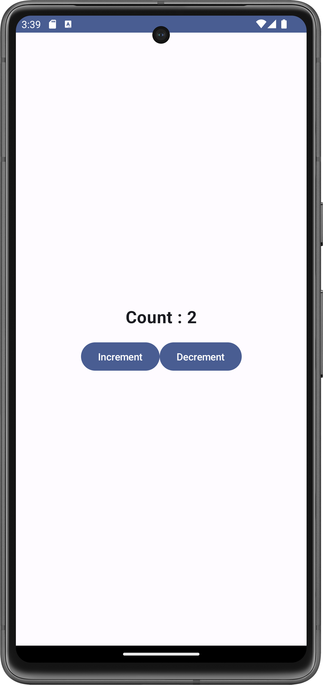

# MyCounterApp

MyCounterApp is an Android application built using Jetpack Compose and Kotlin, demonstrating a simple counter with increment and decrement functionality. The app uses the Model-View-ViewModel (MVVM) architecture to separate concerns and manage state efficiently. This README provides an overview of the implementation and explains how the counter state persists across device orientation changes.

## Project Structure

The project is organized into three main components:

1. **`MainActivity.kt`**: The main entry point of the application, responsible for setting up the UI.
2. **`CounterViewModel.kt`**: Manages the counter state and business logic.
3. **`CounterModel.kt`**: Defines the data model and repository for managing counter data.

## Implementation Details

### MVVM Architecture

#### Model

- **`CounterModel`**: A data class representing the counter's state.
  
  ```kotlin
  data class CounterModel(var count: Int)

- **`CounterRepository`**: Contains methods to manipulate and retrieve counter data.

   ```kotlin
   class CounterRepository {
    private var _counter = CounterModel(0)

    fun getCounter() = _counter
    fun incrementCounter() {
        _counter.count++
    }
    fun decrementCounter() {
        _counter.count--
    }
}

#### ViewModel
- **`CounterViewModel`**: Manages the state of the counter and interacts with the repository. The `ViewModel` retains state across configuration changes like device rotations.
   ```kotlin
   class CounterViewModel : ViewModel() {
    private val _repository = CounterRepository()
    private val _count = mutableStateOf(_repository.getCounter().count)

    val count: MutableState<Int> = _count

    fun increment() {
        _repository.incrementCounter()
        _count.value = _repository.getCounter().count
    }

    fun decrement() {
        _repository.decrementCounter()
        _count.value = _repository.getCounter().count
    }
}
#### View
- **`MainActivity`**: Sets up the Compose UI and provides the `CounterViewModel` to the `TheCounterApp` composable.
   ```kotlin
   class MainActivity : ComponentActivity() {
    override fun onCreate(savedInstanceState: Bundle?) {
        super.onCreate(savedInstanceState)
        setContent {
            val viewModel: CounterViewModel by viewModels()
            MyCounterAppTheme {
                Surface(
                    modifier = Modifier.fillMaxSize(),
                    color = MaterialTheme.colorScheme.background
                ) {
                    TheCounterApp(viewModel)
                }
            }
        }
    }
}
- **`TheCounterApp`**: Displays the counter value and provides buttons to increment and decrement the counter.
```kotlin
   @Composable
fun TheCounterApp(viewModel: CounterViewModel) {
    Column(
        modifier = Modifier.fillMaxSize(),
        verticalArrangement = Arrangement.Center,
        horizontalAlignment = Alignment.CenterHorizontally
    ) {
        Text(
            text = "Count : ${viewModel.count.value}",
            fontSize = 24.sp,
            fontWeight = FontWeight.Bold
        )
        Spacer(modifier = Modifier.height(16.dp))
        Row {
            Button(onClick = { viewModel.increment() }) {
                Text(text = "Increment")
            }
            Button(onClick = { viewModel.decrement() }) {
                Text(text = "Decrement")
            }
        }
    }
}
```

## Persistence of State Across Device Orientation Changes

### How It Works

- **ViewModel Lifecycle**: The `CounterViewModel` is designed to survive configuration changes such as screen rotations. This is achieved through the `ViewModel`'s lifecycle-aware nature, which retains the instance across such changes.

- **State Management**: The counter’s state is managed by the `CounterViewModel` using a `MutableState`. This ensures that the counter value is preserved and remains consistent even when the `Activity` is recreated due to orientation changes.

- **Compose and State**: Jetpack Compose integrates seamlessly with `ViewModel`, ensuring that the UI reflects the current state of the `ViewModel`. When the `Activity` is recreated, the `ViewModel` instance persists, and the state is restored without loss of data.

By leveraging the `ViewModel` and Compose’s state management capabilities, the application maintains a consistent user experience and ensures that the counter value remains unchanged across device orientation changes.
## Screenshots *(Pixel 7 virtual device)*
<div align="center">

<!-- Potrait Mode -->

<p style="text-align:center;">The app in portrait orientation.</em></p>

<!-- Landscape Mode -->

<p style="text-align:center;"><em>The app in landscape orientation.</em></p>


</div>

## Setup and Run

1. **Clone the repository:**

   ```bash
   git clone https://github.com/yourusername/MyCounterApp.git
2. **Open the project in Android Studio.**
3. **Build and run the application on an emulator or physical device.**


